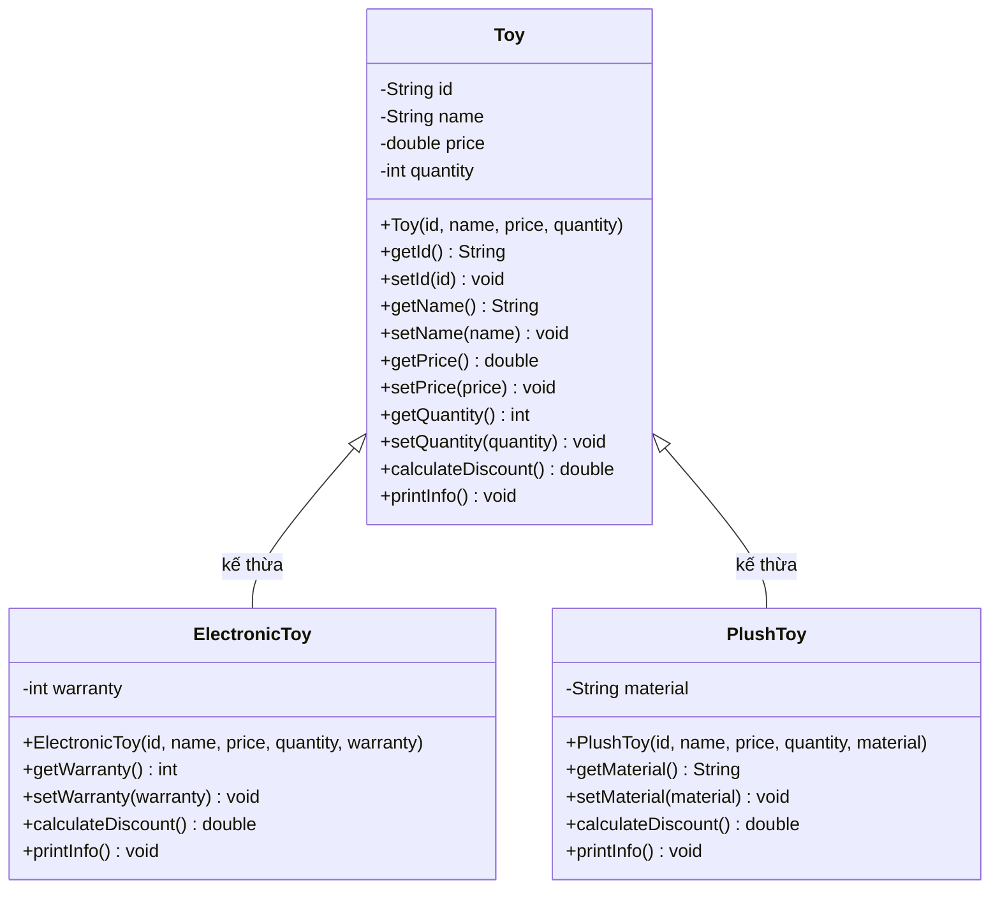
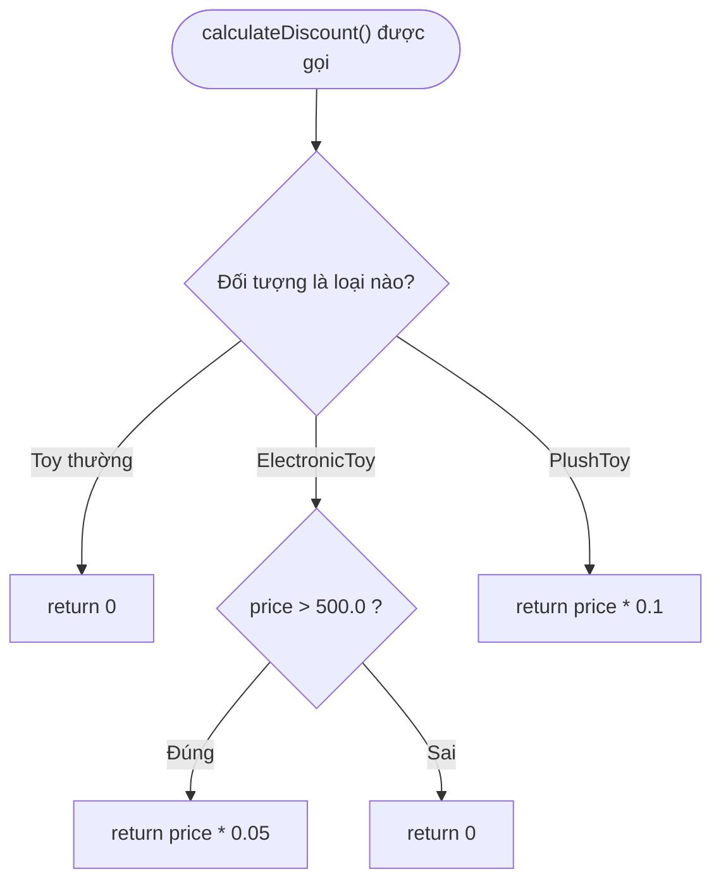
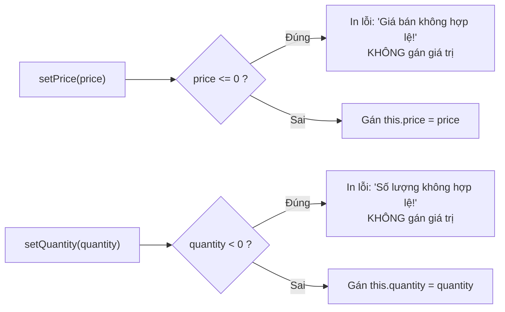
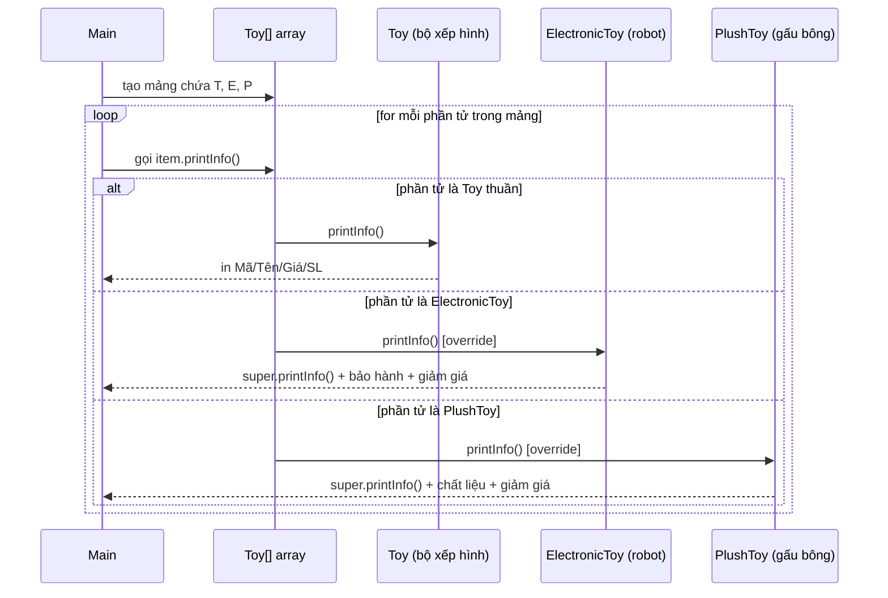

# 🧸 BÀI TẬP BUỔI 4 — Quản Lý Sản Phẩm Cửa Hàng Đồ Chơi (OOP)

> Bản trình bày trực quan của [`Practice.md`](./Practice.md) — cùng một đề bài, dễ nhìn hơn, có sơ đồ và tóm tắt nhanh.

## 📌 Tóm tắt 30 giây

Xây dựng hệ thống quản lý đồ chơi áp dụng đủ 4 trụ cột OOP:

| Trụ cột | Áp dụng trong bài như thế nào |
|---|---|
| 🎭 **Trừu tượng (Abstraction)** | Class `Toy` mô hình hóa một món đồ chơi bất kỳ chỉ với 4 thuộc tính cốt lõi: `id`, `name`, `price`, `quantity` |
| 🔒 **Đóng gói (Encapsulation)** | Mọi thuộc tính đều `private`, chỉ truy cập qua `getter/setter` có kiểm tra hợp lệ (validation) |
| 🧬 **Kế thừa (Inheritance)** | `ElectronicToy` và `PlushToy` kế thừa toàn bộ từ `Toy`, chỉ bổ sung thuộc tính riêng |
| 🎨 **Đa hình (Polymorphism)** | Gọi cùng một hàm `printInfo()` / `calculateDiscount()` trên biến kiểu `Toy`, nhưng Java tự chọn đúng phiên bản override |

**Việc cần làm:** tạo 3 class (`Toy`, `ElectronicToy`, `PlushToy`) trong package `model`, và 1 class `Main` trong package `app` để chứng minh tính đa hình.

---

## 🗺️ Sơ đồ tổng thể dự án

```mermaid
graph TD
    subgraph Package: model
        Toy["Toy<br/>(class cha)"]
        ElectronicToy["ElectronicToy<br/>(class con)"]
        PlushToy["PlushToy<br/>(class con)"]
    end
    subgraph Package: app
        Main["Main<br/>(entry point)"]
    end

    Toy -->|extends| ElectronicToy
    Toy -->|extends| PlushToy
    Main -->|tạo mảng Toy[] & gọi printInfo| Toy
```

---

## 🧩 Sơ đồ lớp (Class Diagram)



> 🔑 **Đọc sơ đồ:** dấu `-` = `private`, dấu `+` = `public`. Mũi tên rỗng (`<|--`) nghĩa là "kế thừa từ".

---

## 📐 Đặc tả entity

> ⚠️ Đây **không phải code Java thật** — chỉ là cách viết interface TypeScript giúp bạn thấy rõ "hình dạng dữ liệu" trước khi code Java. Java không có `interface` kiểu này cho field, nhưng tư duy thiết kế thuộc tính là tương tự.

```typescript
// Class cha — mô hình hóa một món đồ chơi bất kỳ
interface Toy {
  id: string;
  name: string;
  price: number;      // phải > 0, ngược lại setter từ chối gán
  quantity: number;    // phải >= 0, ngược lại setter từ chối gán

  calculateDiscount(): number; // mặc định: return 0
  printInfo(): void;           // in: Mã, Tên, Giá, Số lượng
}

// Đồ chơi điện tử — kế thừa Toy, thêm bảo hành
interface ElectronicToy extends Toy {
  warranty: number; // số tháng bảo hành

  // override: giảm 5% nếu price > 500.0, ngược lại 0
  calculateDiscount(): number;
  // override: in thêm warranty + số tiền giảm giá
  printInfo(): void;
}

// Đồ chơi nhồi bông — kế thừa Toy, thêm chất liệu
interface PlushToy extends Toy {
  material: string; // ví dụ: "Bông gòn", "Nỉ"

  // override: luôn giảm 10% => price * 0.1
  calculateDiscount(): number;
  // override: in thêm material + số tiền giảm giá
  printInfo(): void;
}
```

---

## 🧮 Công thức giảm giá — bảng tra nhanh

| Loại đồ chơi | Điều kiện | `calculateDiscount()` trả về |
|---|---|---|
| `Toy` (thường) | luôn luôn | `0` |
| `ElectronicToy` | `price > 500.0` | `price * 0.05` |
| `ElectronicToy` | `price <= 500.0` | `0` |
| `PlushToy` | luôn luôn | `price * 0.1` |



---

## ✅ Validation trong setter — quy tắc cần nhớ



> 💡 **Vì sao gọi setter trong constructor?** Để không phải viết lại logic kiểm tra 2 lần — constructor "mượn" luôn validation của setter khi khởi tạo object.

---

## 🎨 Đa hình hoạt động ra sao? (Yêu cầu 4)



**Điểm mấu chốt:** biến khai báo kiểu `Toy`, nhưng object thực tế bên trong quyết định phiên bản `printInfo()` nào chạy — đây chính là **đa hình (polymorphism)**.

---

## 📋 Checklist thực hiện (bám theo 4 yêu cầu gốc)

- [ ] **Yêu cầu 1 — `model.Toy`**
  - [ ] 4 thuộc tính `private`: `id`, `name`, `price`, `quantity`
  - [ ] Constructor đầy đủ tham số, gọi setter bên trong
  - [ ] `setPrice` / `setQuantity` có validation + thông báo lỗi đúng câu
  - [ ] `calculateDiscount()` trả về `0`
  - [ ] `printInfo()` in Mã, Tên, Giá, Số lượng

- [ ] **Yêu cầu 2 — `model.ElectronicToy extends Toy`**
  - [ ] Thêm `private int warranty`
  - [ ] Constructor gọi `super(...)`
  - [ ] Getter/setter cho `warranty`
  - [ ] Override `calculateDiscount()`: `price > 500.0` → giảm 5%
  - [ ] Override `printInfo()`: gọi `super.printInfo()` rồi in thêm bảo hành + tiền giảm

- [ ] **Yêu cầu 3 — `model.PlushToy extends Toy`**
  - [ ] Thêm `private String material`
  - [ ] Constructor gọi `super(...)`
  - [ ] Getter/setter cho `material`
  - [ ] Override `calculateDiscount()`: luôn giảm 10%
  - [ ] Override `printInfo()`: gọi `super.printInfo()` rồi in thêm chất liệu + tiền giảm

- [ ] **Yêu cầu 4 — `app.Main`**
  - [ ] Tạo mảng `Toy[]` gồm 3 phần tử (1 `Toy`, 1 `ElectronicToy`, 1 `PlushToy`)
  - [ ] Dùng vòng `for` duyệt mảng, gọi `printInfo()` từng phần tử
  - [ ] Quan sát: cùng lời gọi hàm nhưng kết quả in ra khác nhau tùy loại object

---

## 📚 Xem thêm

Đề bài gốc đầy đủ chi tiết từng dòng: [`Practice.md`](./Practice.md)
