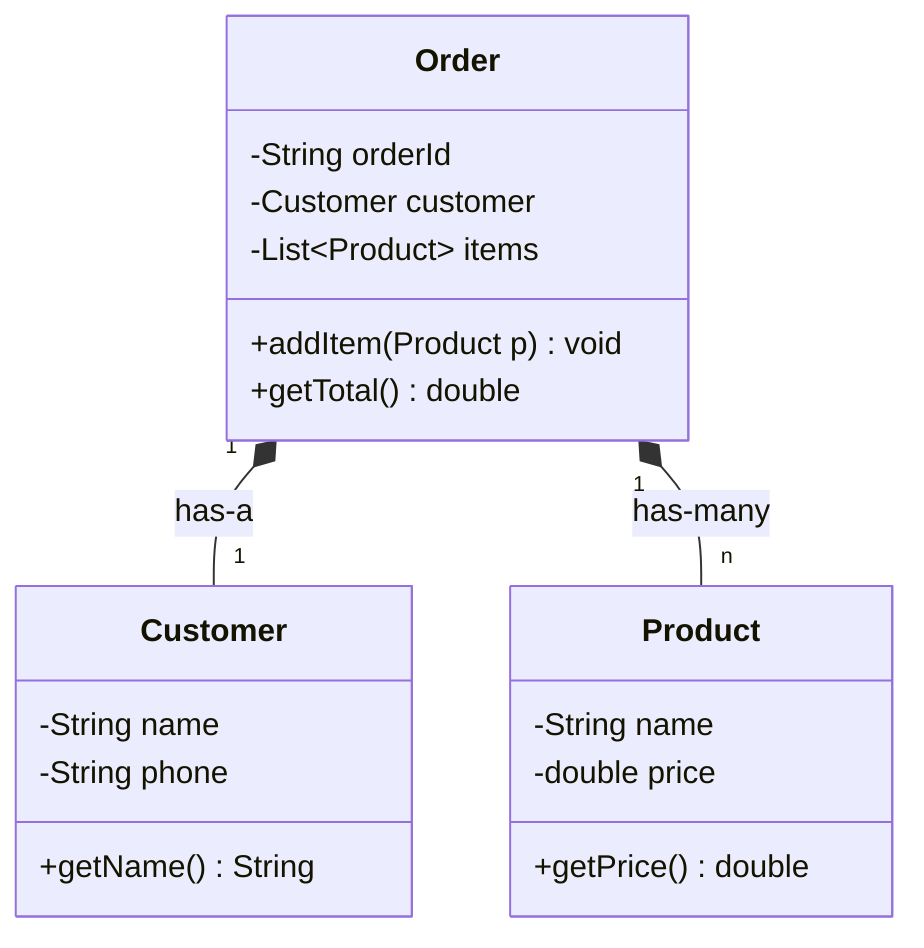
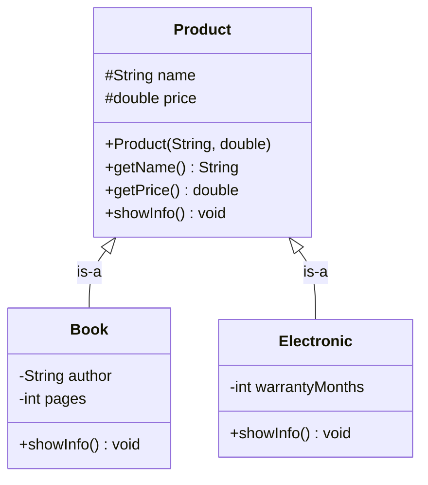
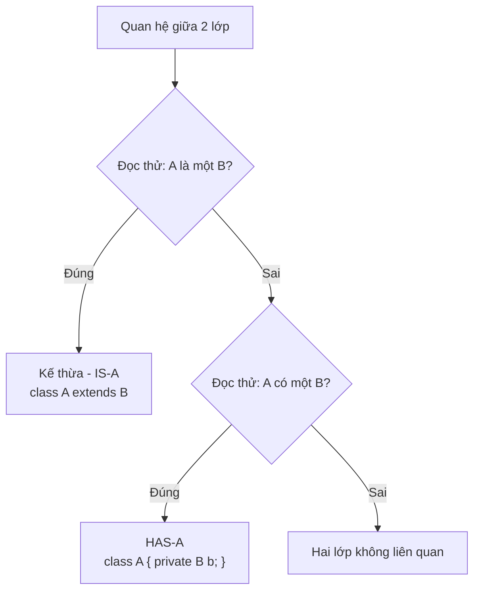

# Buổi 6 — Quan hệ HAS-A, Mảng đối tượng, Kế thừa, Ghi đè phương thức

> **Lớp Java Public 2026 — CLB Tin học HIT**
> Chủ đề xuyên suốt: hệ thống **Cửa hàng bán hàng** (`Product`, `Customer`, `Order`).

---

## Mục tiêu buổi học

Sau buổi này bạn sẽ:

1. Hiểu và cài đặt được quan hệ **HAS-A** (một lớp "có" đối tượng của lớp khác).
2. Khai báo, khởi tạo và duyệt được **mảng đối tượng**, hiểu vì sao `ArrayList` thường tiện hơn.
3. Viết được lớp con bằng **kế thừa** (`extends`), gọi được constructor cha bằng `super`.
4. **Ghi đè** (override) phương thức của lớp cha, đặc biệt là `toString()`.

**Kiến thức cần có từ buổi trước:** class, object, thuộc tính, phương thức, constructor, `getter/setter`, `List` và `ArrayList`.

---

## Phần 1. Quan hệ HAS-A

### 1.1. Khái niệm

Trong thực tế, một sự vật thường **được tạo thành từ** những sự vật khác:

- Một chiếc xe **có** một động cơ.
- Một đơn hàng **có** một khách hàng và **có** nhiều sản phẩm.

Trong Java, ta mô tả điều đó bằng cách cho lớp này **chứa đối tượng của lớp kia làm thuộc tính**. Đó chính là quan hệ **HAS-A** (còn gọi là **Composition** — quan hệ thành phần).

> Cách nhận biết nhanh: đọc câu "A **có một/nhiều** B" mà thấy hợp lý → dùng HAS-A.
> Ví dụ: "Đơn hàng có một khách hàng" ✅ → `Order` chứa `Customer`.

### 1.2. Sơ đồ quan hệ



Đọc sơ đồ: **một** `Order` có **một** `Customer` và có **nhiều** `Product`.

### 1.3. Ví dụ code

```java
// Customer.java
public class Customer {
    private String name;
    private String phone;

    public Customer(String name, String phone) {
        this.name = name;
        this.phone = phone;
    }

    public String getName() { return name; }
    public String getPhone() { return phone; }
}
```

```java
// Product.java
public class Product {
    private String name;
    private double price;

    public Product(String name, double price) {
        this.name = name;
        this.price = price;
    }

    public String getName()  { return name; }
    public double getPrice() { return price; }
}
```

```java
// Order.java
import java.util.ArrayList;
import java.util.List;

public class Order {
    private String orderId;
    private Customer customer;          // HAS-A: 1 đơn hàng có 1 khách hàng
    private List<Product> items;        // HAS-A: 1 đơn hàng có nhiều sản phẩm

    public Order(String orderId, Customer customer) {
        this.orderId = orderId;
        this.customer = customer;
        this.items = new ArrayList<>(); // khởi tạo ngay, tránh null
    }

    public void addItem(Product p) {
        items.add(p);
    }

    public double getTotal() {
        double total = 0;
        for (Product p : items) {
            total += p.getPrice();
        }
        return total;
    }

    public void printInfo() {
        System.out.println("Đơn hàng: " + orderId);
        System.out.println("Khách hàng: " + customer.getName()
                         + " - " + customer.getPhone());
        System.out.println("Danh sách sản phẩm:");
        for (Product p : items) {
            System.out.println("  - " + p.getName() + ": " + p.getPrice());
        }
        System.out.println("Tổng tiền: " + getTotal());
    }
}
```

```java
// Main.java
public class Main {
    public static void main(String[] args) {
        Customer c = new Customer("Nguyễn Văn A", "0987654321");

        Order order = new Order("DH001", c);
        order.addItem(new Product("Bàn phím cơ", 1200000));
        order.addItem(new Product("Chuột không dây", 350000));

        order.printInfo();
    }
}
```

**Kết quả:**

```
Đơn hàng: DH001
Khách hàng: Nguyễn Văn A - 0987654321
Danh sách sản phẩm:
  - Bàn phím cơ: 1200000.0
  - Chuột không dây: 350000.0
Tổng tiền: 1550000.0
```

### 1.4. ⚠️ Lưu ý

- **Luôn khởi tạo `List` trong constructor.** Nếu quên `this.items = new ArrayList<>();` thì `items` mang giá trị `null`, và lời gọi `items.add(...)` sẽ ném **`NullPointerException`**. Đây là lỗi phổ biến nhất khi mới học HAS-A.
- **Kiểm tra `null` trước khi gọi phương thức của đối tượng thành phần.** Nếu `customer == null` thì `customer.getName()` sẽ lỗi ngay.
- **Đối tượng thành phần vẫn là một biến tham chiếu.** Khi viết `Order order = new Order("DH001", c);`, biến `customer` bên trong `order` và biến `c` bên ngoài **cùng trỏ tới một đối tượng**. Sửa qua biến này thì biến kia cũng thấy thay đổi.
- **Đừng nhồi mọi thứ vào một lớp.** Nếu thấy `Order` có các trường `customerName`, `customerPhone`, `customerAddress`… thì đó là dấu hiệu nên tách ra thành lớp `Customer` riêng.

---

## Phần 2. Mảng đối tượng

### 2.1. Mảng đối tượng là gì?

Buổi trước bạn đã dùng mảng số nguyên `int[]`. Mảng đối tượng cũng tương tự, chỉ khác là mỗi phần tử là **một tham chiếu tới đối tượng**.

```java
Product[] products = new Product[3];   // mảng 3 ô, TẤT CẢ đang là null
```

> **Điểm cực kỳ quan trọng:** dòng trên **không** tạo ra 3 sản phẩm. Nó chỉ tạo ra 3 "ô trống" để chứa địa chỉ của sản phẩm. Muốn có sản phẩm thật, phải `new Product(...)` cho từng ô.

### 2.2. Khai báo và khởi tạo

```java
public class Main {
    public static void main(String[] args) {
        // Cách 1: tạo mảng rỗng rồi gán từng phần tử
        Product[] products = new Product[3];
        products[0] = new Product("Bàn phím cơ", 1200000);
        products[1] = new Product("Chuột không dây", 350000);
        products[2] = new Product("Tai nghe", 800000);

        // Cách 2: khai báo và khởi tạo cùng lúc
        Product[] products2 = {
            new Product("Màn hình", 3500000),
            new Product("Webcam", 900000)
        };

        // Duyệt bằng vòng lặp for thường (khi cần biết chỉ số)
        for (int i = 0; i < products.length; i++) {
            System.out.println(i + ". " + products[i].getName());
        }

        // Duyệt bằng for-each (khi chỉ cần đọc từng phần tử)
        for (Product p : products) {
            System.out.println(p.getName() + " - " + p.getPrice());
        }
    }
}
```

### 2.3. Xử lý dữ liệu trên mảng đối tượng

```java
// Tính tổng giá trị
double total = 0;
for (Product p : products) {
    total += p.getPrice();
}
System.out.println("Tổng: " + total);

// Tìm sản phẩm đắt nhất
Product maxProduct = products[0];
for (Product p : products) {
    if (p.getPrice() > maxProduct.getPrice()) {
        maxProduct = p;
    }
}
System.out.println("Đắt nhất: " + maxProduct.getName());

// Tìm theo tên
String keyword = "Tai nghe";
Product found = null;
for (Product p : products) {
    if (p.getName().equals(keyword)) {
        found = p;
        break;
    }
}
if (found != null) {
    System.out.println("Tìm thấy: " + found.getPrice());
} else {
    System.out.println("Không tìm thấy sản phẩm");
}
```

### 2.4. Nhược điểm của mảng thuần → chuyển sang `ArrayList`

Mảng có **kích thước cố định**. Muốn thêm sản phẩm thứ 4 vào mảng 3 phần tử, bạn phải tạo mảng mới và copy sang — rất phiền. `ArrayList` giải quyết chuyện đó.

```java
import java.util.ArrayList;
import java.util.List;

List<Product> products = new ArrayList<>();

products.add(new Product("Bàn phím cơ", 1200000));   // thêm
products.add(new Product("Chuột không dây", 350000));

System.out.println(products.size());       // số phần tử
System.out.println(products.get(0).getName());  // lấy phần tử
products.remove(0);                        // xóa

for (Product p : products) {               // for-each dùng y hệt mảng
    System.out.println(p.getName());
}
```

### 2.5. Bảng so sánh

| Tiêu chí | Mảng `Product[]` | `ArrayList<Product>` |
|---|---|---|
| Kích thước | Cố định khi tạo | Tự động co giãn |
| Lấy số phần tử | `products.length` (thuộc tính) | `products.size()` (phương thức) |
| Lấy phần tử | `products[0]` | `products.get(0)` |
| Gán / thêm | `products[0] = p;` | `products.add(p);` |
| Xóa phần tử | Không có sẵn, phải tự xử lý | `products.remove(0);` |
| Chứa kiểu nguyên thủy | Được (`int[]`, `double[]`) | Không, phải dùng `Integer`, `Double` |
| Khi nào dùng | Biết chắc số lượng, cần hiệu năng cao | Đa số trường hợp thực tế |

### 2.6. ⚠️ Lưu ý

- **`length` không có ngoặc, `size()` có ngoặc.** Đây là lỗi biên dịch mà người mới hay gặp: viết `products.length()` cho mảng hoặc `products.size` cho `ArrayList` đều sai.
- **Phần tử mảng đối tượng mặc định là `null`.** Nếu bạn `new Product[3]` mà chỉ gán 2 ô rồi duyệt for-each gọi `p.getName()`, chương trình sẽ ném `NullPointerException` ở ô thứ 3.
- **Chỉ số mảng bắt đầu từ 0** và kết thúc ở `length - 1`. Truy cập `products[3]` trên mảng 3 phần tử → `ArrayIndexOutOfBoundsException`.
- **So sánh chuỗi dùng `.equals()`, không dùng `==`.** `p.getName() == "Tai nghe"` so sánh địa chỉ, thường cho kết quả `false` ngoài ý muốn.
- **`ArrayList` không chứa kiểu nguyên thủy.** Viết `List<int>` là sai, phải là `List<Integer>`.

---

## Phần 3. Tính kế thừa (Inheritance)

### 3.1. Khái niệm

Cửa hàng của chúng ta bán nhiều loại hàng: sách, đồ điện tử, thực phẩm. Tất cả đều có `name` và `price`, nhưng:

- Sách còn có tác giả, số trang.
- Đồ điện tử còn có thời hạn bảo hành.

Nếu viết 3 lớp riêng biệt, ta phải **lặp lại** `name`, `price`, getter/setter ở cả 3 nơi. **Kế thừa** cho phép gom phần chung vào một lớp **cha** (superclass), rồi các lớp **con** (subclass) "thừa hưởng" lại và bổ sung phần riêng.

> Cách nhận biết: đọc câu "B **là một** A" mà thấy hợp lý → dùng kế thừa (quan hệ **IS-A**).
> "Sách **là một** sản phẩm" ✅ → `Book extends Product`.
> Đối chiếu với phần 1: "Đơn hàng **là một** khách hàng" ❌ → không kế thừa, mà là HAS-A.

### 3.2. Sơ đồ kế thừa



Mũi tên tam giác rỗng trỏ **từ con lên cha**.

### 3.3. Cú pháp và ví dụ

```java
// Lớp cha
public class Product {
    protected String name;    // protected: lớp con truy cập được
    protected double price;

    public Product(String name, double price) {
        this.name = name;
        this.price = price;
    }

    public String getName()  { return name; }
    public double getPrice() { return price; }

    public void showInfo() {
        System.out.println(name + " - " + price + " VNĐ");
    }
}
```

```java
// Lớp con
public class Book extends Product {
    private String author;
    private int pages;

    public Book(String name, double price, String author, int pages) {
        super(name, price);   // BẮT BUỘC gọi constructor cha, ở DÒNG ĐẦU TIÊN
        this.author = author;
        this.pages = pages;
    }

    // Phương thức riêng của Book
    public void showAuthor() {
        System.out.println("Tác giả: " + author);
    }
}
```

```java
public class Electronic extends Product {
    private int warrantyMonths;

    public Electronic(String name, double price, int warrantyMonths) {
        super(name, price);
        this.warrantyMonths = warrantyMonths;
    }

    public int getWarrantyMonths() { return warrantyMonths; }
}
```

```java
// Main.java
public class Main {
    public static void main(String[] args) {
        Book b = new Book("Clean Code", 450000, "Robert C. Martin", 464);
        b.showInfo();     // kế thừa từ Product, dùng luôn không cần viết lại
        b.showAuthor();   // phương thức riêng của Book

        Electronic e = new Electronic("Tai nghe Sony", 800000, 12);
        e.showInfo();
        System.out.println("Bảo hành: " + e.getWarrantyMonths() + " tháng");
    }
}
```

### 3.4. Từ khóa `super`

`super` có 2 công dụng:

```java
public class Book extends Product {
    private String author;

    public Book(String name, double price, String author) {
        super(name, price);            // (1) gọi CONSTRUCTOR của lớp cha
        this.author = author;
    }

    public void showFullInfo() {
        super.showInfo();              // (2) gọi PHƯƠNG THỨC của lớp cha
        System.out.println("Tác giả: " + author);
    }
}
```

### 3.5. Phạm vi truy cập với kế thừa

| Từ khóa | Trong cùng lớp | Lớp con | Lớp khác cùng package | Bên ngoài |
|---|:---:|:---:|:---:|:---:|
| `private` | ✅ | ❌ | ❌ | ❌ |
| *(mặc định)* | ✅ | ✅ (cùng package) | ✅ | ❌ |
| `protected` | ✅ | ✅ | ✅ | ❌ |
| `public` | ✅ | ✅ | ✅ | ✅ |

→ Muốn lớp con truy cập trực tiếp thuộc tính của cha, khai báo `protected`. Nếu để `private`, lớp con vẫn dùng được qua `getter/setter` public.

### 3.6. ⚠️ Lưu ý

- **Java chỉ cho phép đơn kế thừa.** Một lớp chỉ `extends` được **một** lớp cha. `class A extends B, C` là sai cú pháp. (Muốn "nhiều cha" thì dùng `interface` — buổi sau.)
- **`super(...)` phải nằm ở dòng đầu tiên của constructor con.** Đặt sau dòng khác sẽ lỗi biên dịch.
- **Nếu không viết `super(...)`, Java tự chèn `super()` không tham số.** Do đó nếu lớp cha **chỉ có** constructor có tham số (không có constructor rỗng), lớp con **bắt buộc** phải gọi `super(...)` tường minh, nếu không sẽ lỗi biên dịch.
- **Constructor cha luôn chạy trước constructor con.** Thứ tự: `Product(...)` → `Book(...)`.
- **Constructor không được kế thừa.** Lớp con phải tự khai báo constructor của mình.
- **Mọi lớp trong Java đều ngầm kế thừa `Object`.** Vì thế mọi đối tượng đều có sẵn `toString()`, `equals()`, `hashCode()`.
- **Đừng lạm dụng kế thừa.** Nếu quan hệ là "có" chứ không phải "là", hãy dùng HAS-A. Kế thừa sai làm code rối và khó sửa về sau.

---

## Phần 4. Ghi đè phương thức (Method Overriding)

### 4.1. Khái niệm

`Product.showInfo()` chỉ in tên và giá. Nhưng với `Book`, ta muốn in thêm tác giả. **Ghi đè** là việc lớp con **viết lại** phương thức đã có ở lớp cha, với **cùng tên, cùng tham số, cùng kiểu trả về**, nhưng **nội dung khác**.

### 4.2. Ví dụ code

```java
public class Product {
    protected String name;
    protected double price;

    public Product(String name, double price) {
        this.name = name;
        this.price = price;
    }

    public void showInfo() {
        System.out.println("Sản phẩm: " + name + " - " + price + " VNĐ");
    }
}
```

```java
public class Book extends Product {
    private String author;
    private int pages;

    public Book(String name, double price, String author, int pages) {
        super(name, price);
        this.author = author;
        this.pages = pages;
    }

    @Override   // annotation báo cho trình biên dịch kiểm tra hộ
    public void showInfo() {
        System.out.println("Sách: " + name + " - " + price + " VNĐ");
        System.out.println("  Tác giả: " + author + ", " + pages + " trang");
    }
}
```

```java
public class Electronic extends Product {
    private int warrantyMonths;

    public Electronic(String name, double price, int warrantyMonths) {
        super(name, price);
        this.warrantyMonths = warrantyMonths;
    }

    @Override
    public void showInfo() {
        super.showInfo();   // tận dụng lại code của cha
        System.out.println("  Bảo hành: " + warrantyMonths + " tháng");
    }
}
```

```java
public class Main {
    public static void main(String[] args) {
        Product p1 = new Book("Clean Code", 450000, "Robert C. Martin", 464);
        Product p2 = new Electronic("Tai nghe Sony", 800000, 12);
        Product p3 = new Product("Bút bi", 5000);

        p1.showInfo();   // gọi bản của Book
        p2.showInfo();   // gọi bản của Electronic
        p3.showInfo();   // gọi bản của Product
    }
}
```

**Kết quả:**

```
Sách: Clean Code - 450000.0 VNĐ
  Tác giả: Robert C. Martin, 464 trang
Sản phẩm: Tai nghe Sony - 800000.0 VNĐ
  Bảo hành: 12 tháng
Sản phẩm: Bút bi - 5000.0 VNĐ
```

> Chú ý: cả 3 biến đều khai báo kiểu `Product`, nhưng Java gọi đúng phiên bản `showInfo()` của **đối tượng thật** đằng sau. Đây là nền tảng của **tính đa hình** — nội dung buổi 7.

### 4.3. Ghi đè `toString()`

`toString()` là phương thức có sẵn trong `Object`, được gọi tự động khi bạn `System.out.println(object)`. Mặc định nó in ra thứ khó đọc kiểu `Product@1b6d3586`. Hãy ghi đè nó:

```java
public class Product {
    protected String name;
    protected double price;
    // ... constructor ...

    @Override
    public String toString() {
        return "Product{name='" + name + "', price=" + price + "}";
    }
}
```

```java
Product p = new Product("Bút bi", 5000);
System.out.println(p);   // Product{name='Bút bi', price=5000.0}
```

> Mẹo IntelliJ: nhấn `Alt + Insert` → chọn `toString()` để sinh tự động.

### 4.4. Phân biệt Overriding và Overloading

| | **Overriding (Ghi đè)** | **Overloading (Nạp chồng)** |
|---|---|---|
| Xảy ra ở đâu | Giữa **lớp cha và lớp con** | Trong **cùng một lớp** |
| Tên phương thức | Giống nhau | Giống nhau |
| Danh sách tham số | **Phải giống hệt** | **Phải khác nhau** |
| Kiểu trả về | Phải giống (hoặc lớp con của nó) | Có thể khác |
| Quyết định khi nào | Lúc chạy (runtime) | Lúc biên dịch (compile time) |
| Ví dụ | `Book.showInfo()` ghi đè `Product.showInfo()` | `add(int, int)` và `add(double, double)` |

### 4.5. ⚠️ Lưu ý

- **Luôn viết `@Override`.** Nếu bạn gõ nhầm tên (`showInFo()`) hoặc sai tham số, trình biên dịch sẽ báo lỗi ngay thay vì để bạn debug mò. Không có `@Override` thì Java coi đó là một phương thức mới hoàn toàn.
- **Sai tham số = overloading, không phải overriding.** `showInfo(String s)` ở lớp con **không** ghi đè `showInfo()` ở lớp cha.
- **Không được thu hẹp phạm vi truy cập.** Cha là `public` thì con phải `public`, không được đổi thành `private` hay `protected`. Ngược lại (mở rộng) thì được.
- **Không ghi đè được `private`, `static`, `final`:**
  - `private`: lớp con không nhìn thấy.
  - `static`: viết lại chỉ là *che khuất* (hiding), không phải override.
  - `final`: được đánh dấu là cấm ghi đè.
- **Muốn dùng lại logic của cha, gọi `super.tenPhuongThuc()`** thay vì copy-paste code.

---

## Tổng kết



| Khái niệm | Từ khóa | Câu hỏi kiểm tra |
|---|---|---|
| HAS-A | thuộc tính kiểu đối tượng | "A **có** B" |
| Mảng đối tượng | `Type[]`, `ArrayList<Type>` | "Nhiều B cùng loại" |
| Kế thừa | `extends`, `super` | "A **là một** B" |
| Ghi đè | `@Override` | "Con làm khác cha" |

---

## Bài tập luyện tập

### Bài 1 — Quan hệ HAS-A và mảng đối tượng

Xây dựng hệ thống quản lý đơn hàng đơn giản:

1. Lớp `Customer`: `name`, `phone`, `address` + constructor + getter.
2. Lớp `Product`: `id`, `name`, `price`, `quantity` (số lượng mua) + constructor + getter.
3. Lớp `Order`: `orderId`, một `Customer`, và một `Product[]` (dùng **mảng thuần**, kích thước tối đa 10).
   - Phương thức `addProduct(Product p)`: thêm sản phẩm vào ô trống tiếp theo.
   - Phương thức `getTotal()`: trả về tổng tiền = tổng của `price * quantity`.
   - Phương thức `printInvoice()`: in hóa đơn gồm thông tin khách hàng, danh sách sản phẩm và tổng tiền.
4. Trong `main`, tạo 1 khách hàng, thêm 3 sản phẩm và in hóa đơn.

**Gợi ý hướng làm:**
- Trong `Order`, ngoài mảng `Product[] items = new Product[10];` bạn cần thêm một biến đếm `private int count = 0;` để biết đang có bao nhiêu sản phẩm thật. Đây chính là lý do `ArrayList` tồn tại.
- `addProduct` nên kiểm tra `if (count < items.length)` trước khi gán, tránh `ArrayIndexOutOfBoundsException`.
- Khi duyệt để tính tổng, dùng `for (int i = 0; i < count; i++)` chứ **không** dùng `items.length`, nếu không bạn sẽ chạm vào các ô `null`.
- **Làm xong hãy thử viết lại `Order` bằng `List<Product>`** và so sánh xem đoạn code nào ngắn hơn.

---

### Bài 2 — Kế thừa và ghi đè

Mở rộng hệ thống sản phẩm của cửa hàng:

1. Lớp cha `Product`: `name`, `price`, phương thức `showInfo()` và `getFinalPrice()` (mặc định trả về `price`).
2. Ba lớp con:
   - `Book`: thêm `author`, `pages`. Giá cuối được **giảm 10%** so với giá gốc.
   - `Electronic`: thêm `warrantyMonths`. Giá cuối = giá gốc **cộng 5%** phí bảo hành.
   - `Food`: thêm `expiryDate` (kiểu `String`). Giá cuối bằng giá gốc.
3. Mỗi lớp con ghi đè `showInfo()` để in thêm thông tin riêng, và ghi đè `getFinalPrice()`.
4. Trong `main`, tạo một `List<Product>` chứa cả 3 loại, duyệt qua và gọi `showInfo()` cùng `getFinalPrice()` cho từng phần tử.

**Gợi ý hướng làm:**
- Khai báo thuộc tính ở `Product` là `protected` để lớp con dùng trực tiếp `name`, `price`.
- Constructor lớp con nhớ `super(name, price);` ở dòng đầu.
- Trong `showInfo()` của lớp con, gọi `super.showInfo();` trước rồi mới in phần riêng — đỡ phải viết lại.
- Khai báo `List<Product> list = new ArrayList<>();` rồi `list.add(new Book(...))` — hoàn toàn hợp lệ vì `Book` **là một** `Product`.
- Quan sát: dù biến khai báo kiểu `Product`, Java vẫn gọi đúng `getFinalPrice()` của lớp con. Hãy tự giải thích tại sao trước buổi 7.

---

### Bài 3 — Kết hợp HAS-A và kế thừa

Xây dựng hệ thống tài khoản khách hàng của cửa hàng:

1. Lớp `Address`: `street`, `city` + `toString()` được ghi đè.
2. Lớp cha `Account`: `username`, `email`, một đối tượng `Address` (**HAS-A**), phương thức `getDiscount()` trả về `0`.
3. Hai lớp con:
   - `NormalAccount`: `getDiscount()` trả về `0.05` (5%).
   - `VipAccount`: thêm thuộc tính `points`. `getDiscount()` trả về `0.15` nếu `points >= 1000`, ngược lại trả về `0.10`.
4. Cả 3 lớp đều ghi đè `toString()` để in thông tin đầy đủ.
5. Trong `main`, tạo mảng/`List` gồm 3 tài khoản khác loại, in ra mức giảm giá và tổng tiền phải trả cho một đơn hàng trị giá 2.000.000 VNĐ.

**Gợi ý hướng làm:**
- Đây là bài tổng hợp: `Account` **có một** `Address` (HAS-A), còn `VipAccount` **là một** `Account` (IS-A). Vẽ nhanh sơ đồ ra giấy trước khi code.
- Trong `toString()` của `Account`, chỉ cần nối thêm `+ address` — Java sẽ tự gọi `address.toString()` mà bạn đã ghi đè.
- `getDiscount()` của `VipAccount` cần một câu `if` dựa trên `points`. Đây là ví dụ cho thấy lớp con có thể có logic phức tạp hơn cha.
- Tính tiền: `2000000 * (1 - account.getDiscount())`.
- Thử thêm: nếu `address` bị truyền `null` thì `toString()` in ra gì? Chạy thử để thấy Java in chữ `null` chứ không lỗi — nhưng `address.getCity()` thì lỗi ngay.

---

## Chuẩn bị cho buổi 7

Buổi sau sẽ học **tính trừu tượng và đa hình** (`abstract`, `interface`). Trước khi tới lớp, hãy tự trả lời:

> Ở bài 2, tại sao khi khai báo `Product p = new Book(...)` mà gọi `p.showInfo()` thì lại chạy code của `Book` chứ không phải của `Product`?

Và suy nghĩ: nếu lớp `Product` chỉ dùng làm khuôn mẫu, không bao giờ tạo trực tiếp `new Product(...)`, thì có cách nào **cấm** việc khởi tạo nó không?
