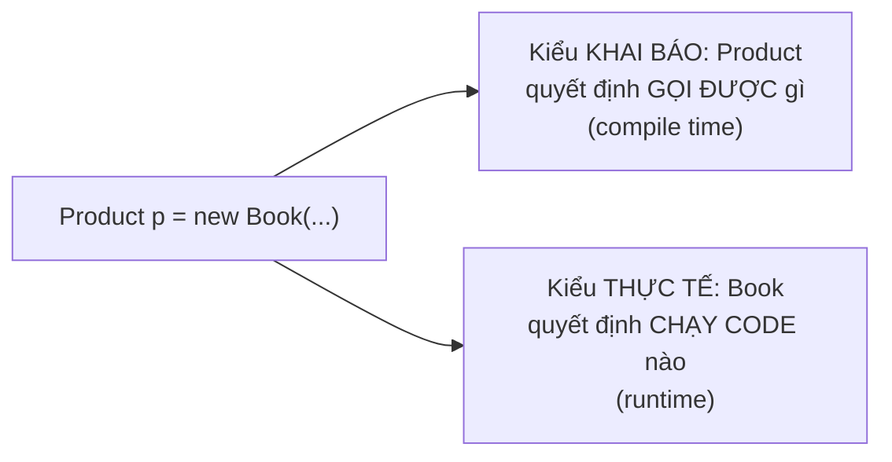
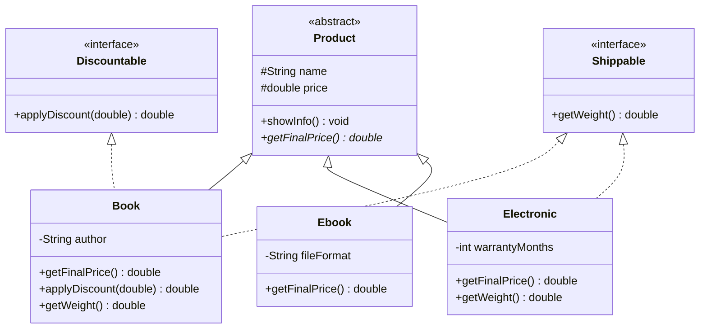
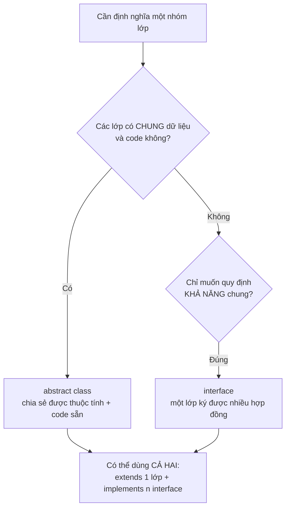
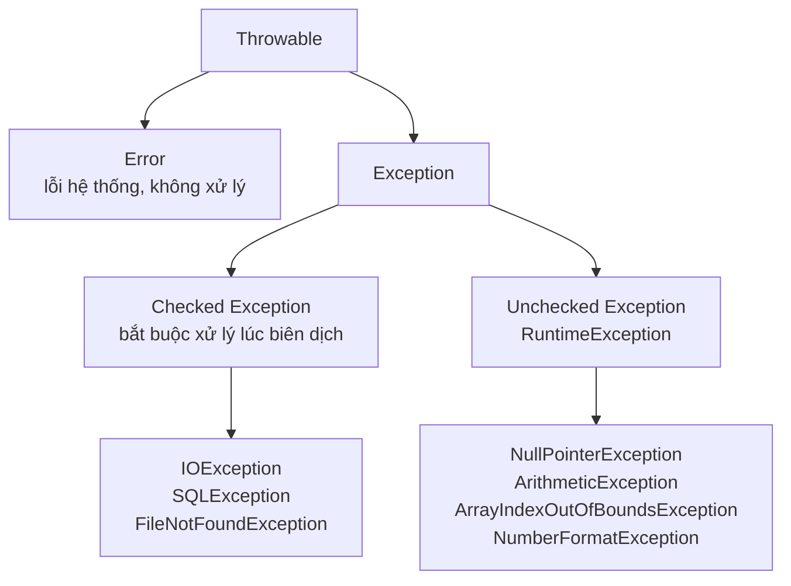
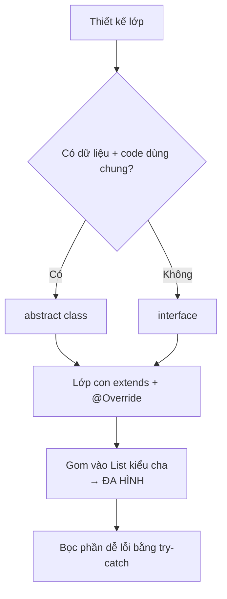

# Buổi 7 — Tính trừu tượng, Đa hình, Interface, Abstract class và Xử lý ngoại lệ

> Chủ đề xuyên suốt: hệ thống **Cửa hàng bán hàng** (`Product`, `Customer`, `Order`) — tiếp nối buổi 6.

---

## Mục tiêu buổi học

Sau buổi này bạn sẽ:

1. Hiểu **tính trừu tượng** và biết khi nào nên giấu bớt chi tiết đi.
2. Giải thích được **tính đa hình**: vì sao cùng một lời gọi `showInfo()` lại chạy code khác nhau.
3. Phân biệt và chọn đúng giữa **`abstract class`** và **`interface`**.
4. Bắt và ném được **ngoại lệ** bằng `try-catch-finally`, `throw`, `throws`, và tự viết được exception riêng.

**Kiến thức cần có từ buổi trước:** class, object, constructor, HAS-A, mảng đối tượng, `ArrayList`, kế thừa (`extends`, `super`), ghi đè (`@Override`).

---

## Phần 1. Tính trừu tượng (Abstraction)

### 1.1. Khái niệm

**Tính trừu tượng** là việc chỉ giữ lại những gì **cần thiết** và giấu đi chi tiết cài đặt bên trong.

Ví dụ đời thường: khi bạn lái xe máy, bạn chỉ cần biết **vặn ga thì xe chạy**. Bạn không cần biết xăng được phun vào buồng đốt như thế nào. Cái tay ga là **giao diện trừu tượng**; động cơ là **chi tiết cài đặt** bị giấu đi.

Trong lập trình, tính trừu tượng trả lời câu hỏi:

> **"Đối tượng này LÀM ĐƯỢC GÌ?"** — chứ không phải "nó làm điều đó BẰNG CÁCH NÀO".

### 1.2. Vì sao cần trừu tượng?

Ở buổi 6 chúng ta có lớp `Product` với phương thức `getFinalPrice()`. Nhưng thử nghĩ kỹ:

```java
Product p = new Product("Bút bi", 5000);
```

Một "sản phẩm chung chung" thì có ý nghĩa gì? Trong cửa hàng thật, mọi món hàng đều phải thuộc **một loại cụ thể**: sách, đồ điện tử, thực phẩm. `Product` chỉ nên là **khuôn mẫu**, không nên tạo trực tiếp.

Đó chính là câu hỏi mở cuối buổi 6. Java cho ta hai công cụ để làm việc này: **`abstract class`** và **`interface`**.

### 1.3. Bốn tính chất của OOP

Đến đây bạn đã đủ 4 mảnh ghép:

| Tính chất | Từ khóa liên quan | Ý nghĩa một câu |
|---|---|---|
| Đóng gói (Encapsulation) | `private`, getter/setter | Giấu dữ liệu, chỉ cho truy cập qua cửa chính |
| Kế thừa (Inheritance) | `extends`, `super` | Lớp con thừa hưởng lớp cha |
| Đa hình (Polymorphism) | `@Override` | Một lời gọi, nhiều cách chạy |
| Trừu tượng (Abstraction) | `abstract`, `interface` | Giấu chi tiết, chỉ lộ ra khả năng |

### 1.4. ⚠️ Lưu ý

- **Trừu tượng khác đóng gói.** Đóng gói giấu **dữ liệu** (`private String name`). Trừu tượng giấu **cách làm** (bạn biết `getFinalPrice()` tồn tại, nhưng không cần biết công thức bên trong).
- **Trừu tượng không phải là viết code phức tạp hơn.** Mục đích cuối cùng là để người dùng lớp của bạn viết code **đơn giản hơn**.
- **Đừng trừu tượng quá sớm.** Với người mới, hãy viết class bình thường trước; khi thấy có từ 2-3 lớp lặp lại cùng một kiểu hành vi thì mới nghĩ tới `abstract` hay `interface`.

---

## Phần 2. Tính đa hình (Polymorphism)

### 2.1. Khái niệm

**Đa hình** = "nhiều hình dạng". Cùng một lời gọi phương thức, nhưng kết quả khác nhau tùy theo **đối tượng thật** đang nằm sau biến đó.

Ở buổi 6 bạn đã gặp hiện tượng này rồi:

```java
Product p1 = new Book("Clean Code", 450000, "Robert C. Martin", 464);
Product p2 = new Electronic("Tai nghe Sony", 800000, 12);

p1.showInfo();   // chạy code của Book
p2.showInfo();   // chạy code của Electronic
```

Cả hai biến đều **khai báo** kiểu `Product`, nhưng Java gọi đúng phiên bản của lớp con. Đây chính là câu hỏi mở cuối buổi 6, và câu trả lời nằm ở mục 2.3.

### 2.2. Upcasting — gán đối tượng con vào biến cha

```java
Book b = new Book("Clean Code", 450000, "Robert C. Martin", 464);
Product p = b;              // Upcasting: tự động, luôn an toàn
```

Vì sao an toàn? Vì `Book` **là một** `Product` (quan hệ IS-A ở buổi 6). Mọi thứ mà `Product` hứa làm được thì `Book` cũng làm được.

Nhờ upcasting, ta có thể gom mọi loại sản phẩm vào chung một danh sách:

```java
List<Product> cart = new ArrayList<>();
cart.add(new Book("Clean Code", 450000, "Robert C. Martin", 464));
cart.add(new Electronic("Tai nghe Sony", 800000, 12));
cart.add(new Food("Bánh quy", 45000, "2026-12-31"));

for (Product p : cart) {
    p.showInfo();           // mỗi phần tử tự in theo cách của mình
}
```

> **Đây là sức mạnh thật sự của đa hình.** Vòng lặp trên không cần biết trong giỏ có bao nhiêu loại hàng. Mai mốt thêm lớp `Clothing`, vòng lặp này **không phải sửa một dòng nào**.

### 2.3. Hai kiểu của một biến



Ghi nhớ hai câu:

- **Kiểu khai báo** (bên trái dấu `=`) quyết định bạn được phép **gọi phương thức nào**.
- **Kiểu thực tế** (bên phải dấu `=`) quyết định **code nào thực sự chạy**.

```java
Product p = new Book("Clean Code", 450000, "Robert C. Martin", 464);

p.showInfo();      // OK — showInfo() có trong Product, chạy bản của Book
p.showAuthor();    // LỖI BIÊN DỊCH — Product không có phương thức showAuthor()
```

Cơ chế "chọn code lúc chạy" này gọi là **Dynamic Method Dispatch** (điều phối phương thức động).

### 2.4. Downcasting và toán tử `instanceof`

Muốn gọi `showAuthor()`, ta phải ép biến về lại kiểu `Book` — gọi là **downcasting**:

```java
Product p = new Book("Clean Code", 450000, "Robert C. Martin", 464);

if (p instanceof Book) {          // KIỂM TRA trước khi ép
    Book b = (Book) p;            // Downcasting: phải ghi rõ (Book)
    b.showAuthor();
}
```

Từ Java 16 có cú pháp gọn hơn, gọi là **pattern matching**:

```java
if (p instanceof Book b) {        // vừa kiểm tra vừa gán, khỏi ép tay
    b.showAuthor();
}
```

Ví dụ đầy đủ — thống kê giỏ hàng:

```java
public class Main {
    public static void main(String[] args) {
        List<Product> cart = new ArrayList<>();
        cart.add(new Book("Clean Code", 450000, "Robert C. Martin", 464));
        cart.add(new Electronic("Tai nghe Sony", 800000, 12));
        cart.add(new Book("Effective Java", 520000, "Joshua Bloch", 412));

        int bookCount = 0;
        for (Product p : cart) {
            p.showInfo();                        // đa hình
            if (p instanceof Book) {             // kiểm tra kiểu thật
                bookCount++;
            }
        }
        System.out.println("Số đầu sách: " + bookCount);
    }
}
```

### 2.5. Đa hình lúc biên dịch và lúc chạy

| | **Compile-time Polymorphism** | **Runtime Polymorphism** |
|---|---|---|
| Còn gọi là | Overloading (nạp chồng) | Overriding (ghi đè) |
| Xảy ra ở | Cùng một lớp | Lớp cha ↔ lớp con |
| Quyết định khi | Lúc biên dịch | Lúc chạy chương trình |
| Ví dụ | `add(int, int)` / `add(double, double)` | `Book.showInfo()` ghi đè `Product.showInfo()` |

Khi nói "đa hình" mà không nói rõ gì thêm, người ta thường ngụ ý **runtime polymorphism**.

### 2.6. ⚠️ Lưu ý

- **Upcasting tự động, downcasting phải ghi rõ.** `Product p = new Book(...)` không cần ép; `Book b = (Book) p` bắt buộc ghi `(Book)`.
- **Downcasting sai kiểu ném `ClassCastException` lúc chạy.** Đoạn `Product p = new Electronic(...); Book b = (Book) p;` biên dịch qua nhưng chạy là văng lỗi. **Luôn kiểm tra bằng `instanceof` trước.**
- **Đa hình chỉ hoạt động với phương thức được ghi đè, không áp dụng cho thuộc tính.** Nếu lớp cha và lớp con cùng có biến `name`, thì `p.name` lấy theo **kiểu khai báo** chứ không phải kiểu thật.
- **`static` không có đa hình.** Phương thức `static` được chọn theo kiểu khai báo lúc biên dịch.
- **Nếu code của bạn đầy `if (p instanceof ...)`, đó là dấu hiệu thiết kế chưa tốt.** Thay vì hỏi "nó là loại gì rồi làm thế này", hãy để mỗi lớp con tự ghi đè một phương thức chung.

---

## Phần 3. Abstract class và Interface

### 3.1. Abstract class — lớp trừu tượng

Quay lại vấn đề ở mục 1.2: ta không muốn ai tạo `new Product(...)` trực tiếp. Thêm từ khóa `abstract`:

```java
public abstract class Product {
    protected String name;
    protected double price;

    public Product(String name, double price) {   // abstract class VẪN CÓ constructor
        this.name = name;
        this.price = price;
    }

    // Phương thức trừu tượng: chỉ khai báo, KHÔNG có thân hàm, kết thúc bằng dấu ;
    public abstract double getFinalPrice();

    // Phương thức thường: có sẵn code, lớp con dùng luôn
    public void showInfo() {
        System.out.println(name + " - Giá gốc: " + price
                         + " - Giá bán: " + getFinalPrice());
    }

    public String getName() { return name; }
}
```

Lớp con **bắt buộc** phải cài đặt các phương thức `abstract`:

```java
public class Book extends Product {
    private String author;

    public Book(String name, double price, String author) {
        super(name, price);
        this.author = author;
    }

    @Override
    public double getFinalPrice() {
        return price * 0.9;          // sách giảm 10%
    }
}
```

```java
public class Electronic extends Product {
    private int warrantyMonths;

    public Electronic(String name, double price, int warrantyMonths) {
        super(name, price);
        this.warrantyMonths = warrantyMonths;
    }

    @Override
    public double getFinalPrice() {
        return price * 1.05;         // cộng 5% phí bảo hành
    }
}
```

```java
public class Main {
    public static void main(String[] args) {
        // Product p = new Product("Bút bi", 5000);   // LỖI: không tạo được abstract class

        List<Product> cart = new ArrayList<>();
        cart.add(new Book("Clean Code", 450000, "Robert C. Martin"));
        cart.add(new Electronic("Tai nghe Sony", 800000, 12));

        for (Product p : cart) {
            p.showInfo();
        }
    }
}
```

**Kết quả:**

```
Clean Code - Giá gốc: 450000.0 - Giá bán: 405000.0
Tai nghe Sony - Giá gốc: 800000.0 - Giá bán: 840000.0
```

### 3.2. Interface — giao diện

`interface` là một **bản hợp đồng**: nó liệt kê những việc mà lớp nào ký vào cũng phải làm được, nhưng không quan tâm làm bằng cách nào.

```java
public interface Discountable {
    double applyDiscount(double percent);   // tự động là public abstract
}
```

```java
public interface Shippable {
    double getWeight();
    String getShippingAddress();
}
```

Một lớp dùng `implements` để "ký hợp đồng", và **có thể ký nhiều hợp đồng cùng lúc**:

```java
public class Book extends Product implements Discountable, Shippable {
    private String author;
    private double weight;

    public Book(String name, double price, String author, double weight) {
        super(name, price);
        this.author = author;
        this.weight = weight;
    }

    @Override
    public double getFinalPrice() {
        return price * 0.9;
    }

    @Override
    public double applyDiscount(double percent) {
        return price * (1 - percent / 100);
    }

    @Override
    public double getWeight() { return weight; }

    @Override
    public String getShippingAddress() { return "Kho Hà Nội"; }
}
```

Đây chính là cách Java giải quyết chuyện **không cho đa kế thừa lớp**: một lớp chỉ `extends` được **một** lớp, nhưng `implements` được **nhiều** interface.

### 3.3. Sơ đồ tổng thể



Đọc sơ đồ: nét **liền** là `extends`, nét **đứt** là `implements`. `Ebook` không cần `Shippable` vì sách điện tử không phải giao hàng — đó là lý do ta tách khả năng "giao hàng được" ra thành interface riêng thay vì nhét hết vào `Product`.

### 3.4. So sánh Abstract class và Interface

| Tiêu chí | `abstract class` | `interface` |
|---|---|---|
| Từ khóa dùng | `extends` | `implements` |
| Số lượng | Chỉ **1** lớp cha | **Nhiều** interface |
| Thuộc tính | Đủ loại, có trạng thái riêng | Chỉ hằng `public static final` |
| Constructor | **Có** | **Không** |
| Phương thức thường | Có | Có, nhưng phải là `default` hoặc `static` |
| Phạm vi truy cập | `private`, `protected`, `public` | Mặc định `public` |
| Ý nghĩa quan hệ | **IS-A** — "là một" | **CAN-DO** — "làm được việc" |
| Ví dụ | `Book` **là một** `Product` | `Book` **có thể** `Discountable` |

### 3.5. Chọn cái nào?



Quy tắc thực dụng cho người mới:

- Có **dữ liệu và code dùng chung** giữa các lớp con → **`abstract class`**.
- Chỉ muốn nói "các lớp này đều **làm được** việc X" → **`interface`**.
- Phân vân → chọn `interface`, vì nó linh hoạt hơn.

### 3.6. Phương thức `default` trong interface

Từ Java 8, interface được phép có phương thức **có sẵn code** bằng từ khóa `default`. Mục đích: thêm phương thức mới vào interface mà không làm vỡ các lớp đã `implements` từ trước.

```java
public interface Discountable {
    double applyDiscount(double percent);

    default void printDiscountNote() {          // có thân hàm
        System.out.println("San pham nay duoc ap dung khuyen mai.");
    }
}
```

Lớp `implements` có thể dùng luôn hoặc ghi đè lại tùy ý.

### 3.7. ⚠️ Lưu ý

**Về `abstract class`:**

- **Không tạo được đối tượng:** `new Product(...)` là lỗi biên dịch. Nhưng `Product p = new Book(...)` thì hợp lệ.
- **Abstract class vẫn có constructor**, dùng để lớp con gọi bằng `super(...)`.
- **Phương thức `abstract` kết thúc bằng dấu `;`, không có `{}`.** Viết `public abstract void showInfo() {}` là sai.
- **Có phương thức `abstract` thì lớp bắt buộc phải `abstract`.** Ngược lại, lớp `abstract` không nhất thiết phải có phương thức abstract nào.
- **Lớp con phải cài đặt hết** các phương thức abstract của cha, nếu không thì chính nó cũng phải khai báo `abstract`.

**Về `interface`:**

- **Không có constructor**, không tạo được đối tượng trực tiếp.
- **Mọi biến trong interface đều là `public static final`** (hằng số), dù bạn không ghi ra. Nên đừng dùng interface để lưu trạng thái.
- **Mọi phương thức mặc định là `public abstract`.** Khi lớp cài đặt, phải để `public`, không được thu hẹp thành `private`.
- **Nhớ `@Override`** khi cài đặt phương thức của interface, để trình biên dịch kiểm tra hộ.

**Chung:**

- **`extends` dùng cho lớp, `implements` dùng cho interface.** Viết `class Book implements Product` khi `Product` là lớp là sai cú pháp.
- Nếu dùng cả hai thì `extends` viết trước: `class Book extends Product implements Discountable`.

---

## Phần 4. Xử lý ngoại lệ (Exception Handling)

### 4.1. Ngoại lệ là gì?

**Ngoại lệ (exception)** là một sự kiện bất thường xảy ra **lúc chương trình đang chạy**, làm luồng thực thi bình thường bị gián đoạn.

Bạn đã gặp chúng nhiều lần ở buổi 6 rồi:

- `NullPointerException` — quên khởi tạo `ArrayList`.
- `ArrayIndexOutOfBoundsException` — truy cập `products[3]` trên mảng 3 phần tử.

Không xử lý thì chương trình **dừng đột ngột** và in ra một đống chữ đỏ. Xử lý thì chương trình **vẫn chạy tiếp** và báo lỗi tử tế cho người dùng.

```java
int[] arr = {1, 2, 3};
System.out.println(arr[5]);
System.out.println("Dòng này KHÔNG BAO GIỜ chạy nếu không xử lý ngoại lệ");
```

### 4.2. Phân loại ngoại lệ



| Loại | Đặc điểm | Nguyên nhân thường gặp |
|---|---|---|
| **Checked** | Trình biên dịch **bắt buộc** bạn xử lý, nếu không thì không build được | Yếu tố bên ngoài: đọc file, kết nối mạng, truy vấn database |
| **Unchecked** | Không bắt buộc, chương trình vẫn build được | Lỗi logic của lập trình viên: quên kiểm tra `null`, sai chỉ số, chia cho 0 |
| **Error** | Lỗi nghiêm trọng của JVM, **không nên bắt** | `OutOfMemoryError`, `StackOverflowError` |

### 4.3. Cấu trúc `try-catch-finally`

```java
public class Main {
    public static void main(String[] args) {
        int[] arr = {1, 2, 3};

        try {
            System.out.println(arr[5]);           // ném ngoại lệ tại đây
            System.out.println("Dòng này bị bỏ qua");
        } catch (ArrayIndexOutOfBoundsException e) {
            System.out.println("Lỗi: chỉ số vượt quá kích thước mảng");
            System.out.println("Chi tiết: " + e.getMessage());
        } finally {
            System.out.println("Khối finally LUÔN chạy");
        }

        System.out.println("Chương trình tiếp tục bình thường");
    }
}
```

**Kết quả:**

```
Lỗi: chỉ số vượt quá kích thước mảng
Chi tiết: Index 5 out of bounds for length 3
Khối finally LUÔN chạy
Chương trình tiếp tục bình thường
```

Vai trò từng khối:

| Khối | Nhiệm vụ | Bắt buộc? |
|---|---|---|
| `try` | Bọc đoạn code **có thể** sinh lỗi | Có |
| `catch` | Xử lý khi lỗi xảy ra | Cần ít nhất `catch` hoặc `finally` |
| `finally` | Dọn dẹp, chạy **dù có lỗi hay không** | Không |

### 4.4. Bắt nhiều loại ngoại lệ

```java
public class Main {
    public static void main(String[] args) {
        try {
            String input = "abc";
            int quantity = Integer.parseInt(input);   // NumberFormatException
            int total = 1000 / quantity;              // ArithmeticException
            System.out.println(total);

        } catch (NumberFormatException e) {
            System.out.println("Số lượng phải là một số nguyên");

        } catch (ArithmeticException e) {
            System.out.println("Số lượng không được bằng 0");

        } catch (Exception e) {
            System.out.println("Lỗi không xác định: " + e.getMessage());
        }
    }
}
```

Từ Java 7, gộp được nhiều loại vào một `catch` bằng dấu `|`:

```java
try {
    // ...
} catch (NumberFormatException | ArithmeticException e) {
    System.out.println("Dữ liệu nhập vào không hợp lệ");
}
```

### 4.5. `throw` và `throws`

Hai từ khóa khác nhau, rất dễ nhầm:

- **`throw`** — **ném ra** một ngoại lệ ngay tại chỗ. Đứng trong thân hàm.
- **`throws`** — **khai báo** rằng phương thức này có thể ném ra loại ngoại lệ nào. Đứng ở phần khai báo hàm.

```java
public class Order {
    private List<Product> items = new ArrayList<>();

    public void addItem(Product p) {
        if (p == null) {
            throw new IllegalArgumentException("San pham khong duoc null");
        }
        items.add(p);
    }

    // Khai báo: hàm này CÓ THỂ ném ngoại lệ, người gọi phải lo
    public void checkout(double customerBalance) throws Exception {
        double total = getTotal();
        if (customerBalance < total) {
            throw new Exception("So du khong du. Can them "
                              + (total - customerBalance) + " VND");
        }
        System.out.println("Thanh toan thanh cong: " + total + " VND");
    }

    public double getTotal() {
        double sum = 0;
        for (Product p : items) sum += p.getFinalPrice();
        return sum;
    }
}
```

```java
public class Main {
    public static void main(String[] args) {
        Order order = new Order();
        order.addItem(new Book("Clean Code", 450000, "Robert C. Martin"));

        try {
            order.checkout(100000);        // không đủ tiền
        } catch (Exception e) {
            System.out.println("Thanh toan that bai: " + e.getMessage());
        }
    }
}
```

### 4.6. Tự tạo ngoại lệ riêng

Khi các exception có sẵn không diễn tả đúng vấn đề nghiệp vụ, hãy tự viết một lớp exception. Chỉ cần `extends Exception` (checked) hoặc `extends RuntimeException` (unchecked):

```java
public class OutOfStockException extends Exception {
    private String productName;

    public OutOfStockException(String productName) {
        super("San pham '" + productName + "' da het hang");
        this.productName = productName;
    }

    public String getProductName() { return productName; }
}
```

```java
public class Inventory {
    public void sell(String productName, int stock, int quantity)
            throws OutOfStockException {
        if (quantity > stock) {
            throw new OutOfStockException(productName);
        }
        System.out.println("Da ban " + quantity + " " + productName);
    }
}
```

```java
public class Main {
    public static void main(String[] args) {
        Inventory inv = new Inventory();
        try {
            inv.sell("Tai nghe Sony", 3, 5);
        } catch (OutOfStockException e) {
            System.out.println(e.getMessage());
            System.out.println("Goi y: dat truoc san pham " + e.getProductName());
        }
    }
}
```

**Kết quả:**

```
San pham 'Tai nghe Sony' da het hang
Goi y: dat truoc san pham Tai nghe Sony
```

### 4.7. ⚠️ Lưu ý

- **Thứ tự `catch` phải từ con đến cha.** Đặt `catch (Exception e)` lên trước `catch (NumberFormatException e)` là lỗi biên dịch, vì `Exception` đã bắt hết rồi, khối sau không bao giờ tới lượt.
- **Đừng nuốt ngoại lệ.** Viết `catch (Exception e) {}` với thân rỗng là thói quen tệ nhất khi mới học — lỗi vẫn xảy ra nhưng bạn không hề biết. Ít nhất hãy in ra `e.getMessage()`.
- **Đừng dùng `catch (Exception e)` cho mọi thứ.** Bắt càng cụ thể càng dễ xử lý đúng và dễ đọc.
- **`finally` luôn chạy**, kể cả khi trong `try` có `return`. Dùng nó để đóng file, đóng kết nối.
- **Đừng dùng exception thay cho `if`.** Kiểm tra `if (index < arr.length)` nhanh và rõ hơn nhiều so với việc để nó văng lỗi rồi bắt.
- **`throw` ném một đối tượng, `throws` khai báo một kiểu.** Nhớ: `throw new XyzException(...)` — có `new`; `throws XyzException` — không có `new`.
- **Gọi phương thức có `throws` checked exception thì bắt buộc phải `try-catch` hoặc `throws` tiếp lên trên.**
- **Luôn viết message có ích.** `"Loi"` không giúp được ai. `"So du khong du. Can them 350000 VND"` thì có.

---

## Tổng kết



| Khái niệm | Từ khóa | Câu hỏi kiểm tra |
|---|---|---|
| Trừu tượng | `abstract` | "Nó làm được gì?" |
| Đa hình | `@Override`, upcasting | "Cùng lời gọi, khác kết quả" |
| Abstract class | `extends` | "A **là một** B, dùng chung code" |
| Interface | `implements` | "A **làm được** việc X" |
| Ngoại lệ | `try-catch`, `throw`, `throws` | "Nếu chỗ này lỗi thì sao?" |

---

## Bài tập luyện tập

### Bài 1 — Abstract class và đa hình

Xây dựng hệ thống tính lương nhân viên cửa hàng:

1. Lớp `abstract Employee`: `name`, `id`, phương thức `abstract double calculateSalary()` và phương thức thường `showInfo()` (in tên, mã và lương).
2. Ba lớp con:
   - `FullTimeEmployee`: có `monthlySalary`. Lương = `monthlySalary`.
   - `PartTimeEmployee`: có `hoursWorked` và `hourlyRate`. Lương = `hoursWorked * hourlyRate`.
   - `SalesEmployee`: có `baseSalary` và `totalSales`. Lương = `baseSalary + totalSales * 0.03`.
3. Trong `main`, tạo `List<Employee>` gồm 4 nhân viên khác loại, duyệt qua in thông tin và tính **tổng quỹ lương**.
4. Đếm xem có bao nhiêu nhân viên `SalesEmployee` bằng `instanceof`.

**Gợi ý hướng làm:**
- `Employee` phải có từ khóa `abstract` ở cả lớp lẫn phương thức `calculateSalary()`. Phương thức abstract kết thúc bằng dấu `;`, không có `{}`.
- Trong `showInfo()` của lớp cha, cứ gọi thẳng `calculateSalary()` — lúc chạy Java sẽ tự chọn đúng phiên bản của lớp con. Đây chính là đa hình.
- Constructor lớp con nhớ `super(name, id);` ở dòng đầu.
- Thử `new Employee("A", "E01")` xem trình biên dịch báo gì, để hiểu vì sao lớp abstract không tạo được đối tượng.

---

### Bài 2 — Interface

Bổ sung khả năng cho hệ thống sản phẩm:

1. Interface `Discountable`: một phương thức `double applyDiscount(double percent)`.
2. Interface `Shippable`: hai phương thức `double getWeight()` và `double getShippingFee()`.
3. Lớp `abstract Product`: `name`, `price`, `abstract double getFinalPrice()`.
4. Ba lớp con:
   - `Book extends Product implements Discountable, Shippable` — phí ship = `weight * 15000`.
   - `Electronic extends Product implements Shippable` — phí ship = `weight * 20000`, không giảm giá.
   - `Ebook extends Product implements Discountable` — không có phí ship vì là hàng số.
5. Trong `main`, tạo `List<Product>` gồm cả 3 loại. Duyệt qua:
   - In giá cuối của mọi sản phẩm.
   - Nếu sản phẩm `instanceof Shippable` thì in thêm phí vận chuyển.
   - Nếu `instanceof Discountable` thì in giá sau khi giảm 20%.

**Gợi ý hướng làm:**
- Thứ tự viết đúng là `extends` trước, `implements` sau: `class Book extends Product implements Discountable, Shippable`.
- Trong vòng lặp, để gọi được `getShippingFee()` bạn phải ép kiểu: `if (p instanceof Shippable s) { s.getShippingFee(); }`. Chú ý là ép về **interface**, không phải về lớp con cụ thể — như vậy code không cần sửa khi thêm lớp mới.
- `Ebook` không `implements Shippable`, nên nó sẽ tự động bị bỏ qua ở nhánh phí ship. Đây là lý do ta tách khả năng thành interface riêng.
- Nếu quên `@Override` một phương thức của interface, trình biên dịch sẽ báo lỗi ngay — hãy thử để thấy thông báo trông như thế nào.

---

### Bài 3 — Xử lý ngoại lệ

Xây dựng chức năng bán hàng có kiểm tra kho:

1. Tự tạo hai lớp ngoại lệ:
   - `OutOfStockException extends Exception` — nhận tên sản phẩm và số lượng còn lại.
   - `InvalidQuantityException extends RuntimeException` — khi số lượng mua `<= 0`.
2. Lớp `Product`: `name`, `price`, `stock` (số lượng tồn kho).
3. Lớp `Store` với phương thức `double sell(Product p, int quantity) throws OutOfStockException`:
   - Nếu `quantity <= 0` → `throw new InvalidQuantityException(...)`.
   - Nếu `quantity > p.getStock()` → `throw new OutOfStockException(...)`.
   - Ngược lại: trừ kho, trả về tổng tiền.
4. Trong `main`, gọi `sell()` với 4 tình huống: mua bình thường, mua số lượng 0, mua quá tồn kho, và mua âm. Bọc trong `try-catch` để chương trình **chạy hết cả 4 lần** mà không dừng giữa chừng.
5. Thêm khối `finally` in ra `"--- Ket thuc giao dich ---"` sau mỗi lần.

**Gợi ý hướng làm:**
- Lớp exception tự tạo chỉ cần một constructor gọi `super("thong bao loi")`. Muốn lấy thông báo đó ra thì dùng `e.getMessage()`.
- `OutOfStockException extends Exception` là **checked**, nên phương thức `sell()` bắt buộc phải có `throws OutOfStockException`, và nơi gọi bắt buộc phải `try-catch`. Còn `InvalidQuantityException extends RuntimeException` là **unchecked**, không cần khai báo — hãy so sánh xem trình biên dịch đối xử với hai loại này khác nhau thế nào.
- Đặt `catch` cụ thể trước, `catch (Exception e)` sau cùng. Thử đảo ngược thứ tự để xem lỗi biên dịch.
- Để chạy hết 4 tình huống, đặt mỗi lần gọi trong một `try-catch` riêng, hoặc cho cả 4 vào vòng lặp với `try-catch` bên trong thân vòng lặp.
- Kiểm chứng `finally`: thêm `return` vào trong khối `try` rồi chạy lại, xem `finally` có còn in ra không.


